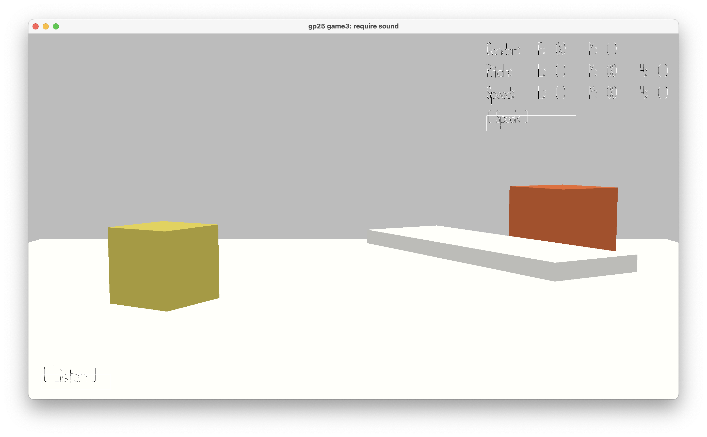

The Greatest Parrot

Author: Cheyu Tu

Design: You are a parrot superstar known for your ability to imitate any voice. Some fans are coming to see you. Entertain them by successfully imitating their voice!

Screen Shot:

How To Play:

When a fan arrives, they will speak something to you. (If you didn't hear it clearly, click "Listen" to let them repeat)

Then, to imitate their voice, try to choose the correct qualities for gender, pitch, and speed on the UI on the right based on what you heard.

When you're ready, click "Speak".

You can only proceed to the next fan if all three qualities are correct.

This game was built with [NEST](NEST.md).
